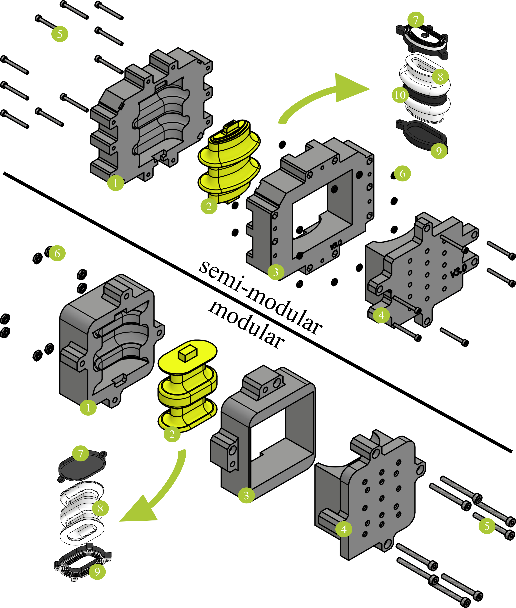

# Cast Bellows
The 3D-printed soft bellows are problematic for long-term use: the material ages over time and becomes porous. In addition, the layer-by-layer production causes the bellows to fail after just a few load cycles. The silicone casting process is an alternative, as the entire membrane cures homogeneously. For both robots, it is shown how cast bellows can be manufactured to replace the printed ones. The semi-modular bellows consists of an additional ring that prevents ballooning.

## Downloads

* 3D models (semi-modular bellows)
   * [Files for 3D-Printer (.stl)](/sponge/downloads/SPONGE_SemiModular_SiliconeBellow_stl.zip)
   * [CAD-Files (.stp)](/sponge/downloads/SPONGE_SemiModular_SiliconeBellow_step.zip)

* 3D models (modular bellows)
  * [Files for 3D-Printer (.stl)](/sponge/downloads/SPONGE_Modular_SiliconeBellow_stl.zip)
  * [CAD-Files (.stp)](/sponge/downloads/SPONGE_Modular_SiliconeBellow_step.zip)

## Components

|part no. | name | function | quantity   per bellows   (semi-modular)| quantity   per bellows   (modular)|
| :----: | :----: | :----: | :----: | :----: |
| **(1)** | lower mold | casting | 1 | 1
| **(2)** | core | casting | 1 | 1
| **(3)** | upper mold | casting | 1 | 1
| **(4)** | plug | casting| 1 |1
| **(5)** | screw M2x20 | mounting| 16 | 8
| **(6)** | nut M2 | mounting | 16 |8
| **(7)** | upper platform | mounting   semi-modular: sealing | 1 |1
| **(8)** | cast membrane | actuation | 1 |1
| **(9)** | lower plattform | mounting   modular: sealing | 1 |1
| **(10)** | ring | prevent  ballooning | 1 |0

## Manufacturing and Assembly
This procedure was successfully tested with the silicone [Dragon Skin 15](https://www.smooth-on.com/products/dragon-skin-15/).
### Mold Preparation
1. Position **(2)** in **(1)**. Make sure that **(2)** points in the right direction.
2. Mount **(3)** to **(1)**/**(2)** using **(5)**/**(6)**.

### Casting
Several vacuum/pressure cycles are used to eliminate trapped air bubbles in the membrane. The cycle time depends on the pot time of the used silicone (Dragon Skin 15: 40 minutes). It is recommended to use a silicone with a long pot time.
1. Mix both silicone parts (A+B) according to the manufacturer's instruction and place them in a vacuum pump.
2. Start the vacuum pump and leave the temperature controller at room temperature.
3. After 8 minutes, pressurize the vacuum chamber for around 5 seconds and then continue the pump.
4. After another 8 minutes, pressurize the vacuum chamber and take the cup out of the pump.
5. Pour the silicone into the mold, place it into the vacuum chamber and start the pump.
6. Continue again with vacuum/pressure cycles: 8 minutes vacuum and 5 seconds pressurization. During the cycle, the absolute pressure inside the vacuum chamber varies between 7mbar and 512mbar. This depends on the vacuum pump used. After the third cycle, continue the vacuum for 5 minutes and then remove the mold from the vacuum chamber.
7. Attach **(4)** to the remaining mold parts **(1)**/**(2)**/**(3)**. Use a screw clamp in order to push out excess silicone.
8. Cure the silicone for the time specified by the manufacturer (Dragon Skin 15: 7 hours).

### Post-Processing
1. Take out **(8)** with **(2)** from the mold.
2. Remove carefully **(2)**. This is possible due to the soft material.
3. Cut off excess cured silicone from **(8)**. **Only for semi-modular bellows**: Place **(10)** between the folds of **(8)**.
4. Glue **(9)** to the bottom of **(8)** using silicone rubber adhesive ([Sil-Poxy](https://www.smooth-on.com/products/sil-poxy/) was used initially. However, superglues are stronger, cured within a few minutes and cheaper. We therefore switched to [UHU superglue](https://www.uhu.com/de-de/produkte/uhu-alleskleber-super-blister-7-g-de)).
5. Glue **(7)** to the top of **(8)** using the same silicone glue.
6. Cure the glue for the time specified by the manufacturer (Sil-Poxy: 24 hours, UHU superglue: few minutes).

## 3D-printing

When you downloaded the .stl files (links above), you need to pay attention to the preparation of the files for printing. The sealed platform of the bellows, printed with Polyjet technology, need to be printed as an assembly due to the sealing. Use “add as assembly” to create the print job.

| part no. |material | files |
| :----: | :----: | :----: |
|**(1)**|PLA filament | lower_mold.stl |
|**(2)**|PLA filament | core.stl |
|**(3)**|PLA filament | upper_mold.stl|
|**(4)**|PLA filament | plug.stl|
|**(7)**|Agilus30 | semi-modular: cast_bellow_upper_platform_seal.stl |
|**(7)**|VeroBlackPlus/VeroWhitePlus | cast_bellow_upper_platform.stl |
|**(9)**|VeroBlackPlus/VeroWhitePlus | cast_bellow_lower_platform.stl |
|**(9)**|Agilus30 | modular: cast_bellow_lower_platform_seal.stl |
|**(10)**|VeroBlackPlus/VeroWhitePlus | ring.stl |
