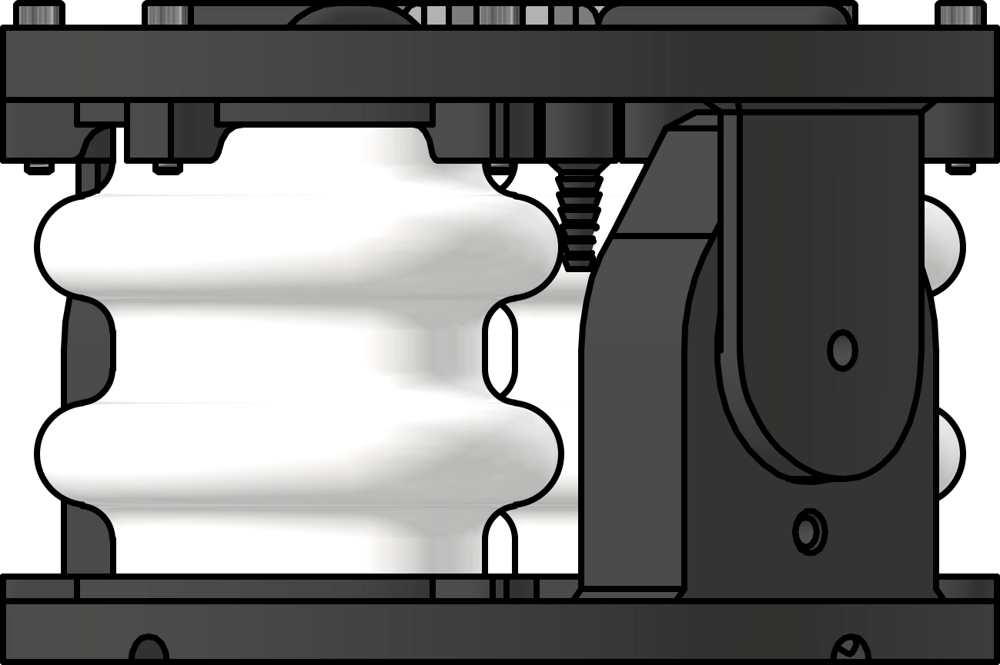
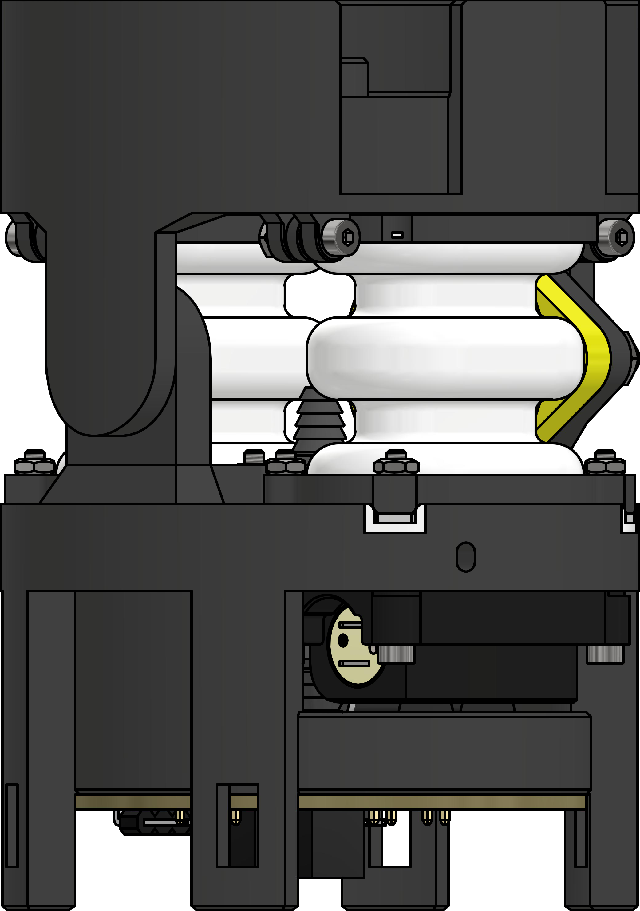

# Designs
Both actuators consist of a rigid frame, a 1-DoF joint and two antagonistic soft air bellows. The joint angle is measured using a Hall encoder. The **semi-modular** actuator has one pneumatic pipe per bellow connected to it. When stacked, the pipes and sensor cables are led through the whole system, leading to an increased footprint if many actuators are to be stacked. The **modular** actuator has integrated microvalves connected to one single pneumatic supply line for the whole system. A PCB within each actuator realizes modular communication to control the valves and read the encoder. This way, the footprint remains constant for an arbitrary number of stacked actuators.

|semi-modular|modular|
| :----: | :----: |
| | |

The actuators are (except for electronic components and screws/nuts) fully 3D-printable. They are printed using Polyjet technology, enabling multi-material printing. This way, the soft air bellows with rigid platforms can be printed. The valve interfaces for integrating the microvalves into the modular actuator are printed using resin technology, as this allows better surface smoothness to achieve airtightness.

| printer| materials |
| :----: | :----: |
[Stratasys Objet350 Connex3](https://www.stratasys.com/en/) | VeroBlackPlus/VeroWhitePlus  Agilus30   SUP706|
 [Formlabs Form2](https://formlabs.com/3d-printers/form-2/) | BlackV4|
| [Ultimaker 3](https://www.ultimaker-3.de/) | any PLA filament|
