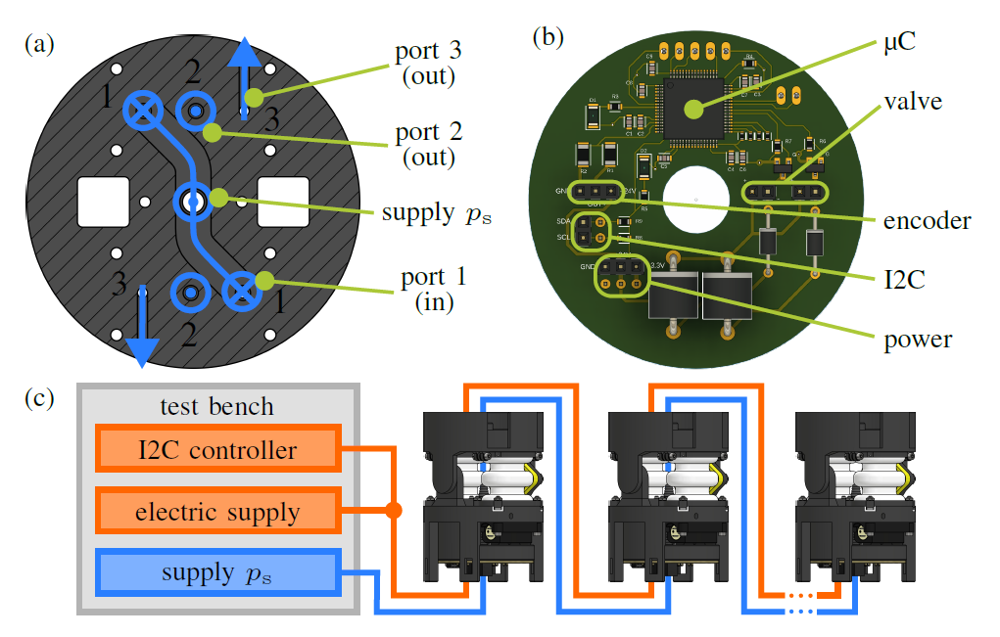
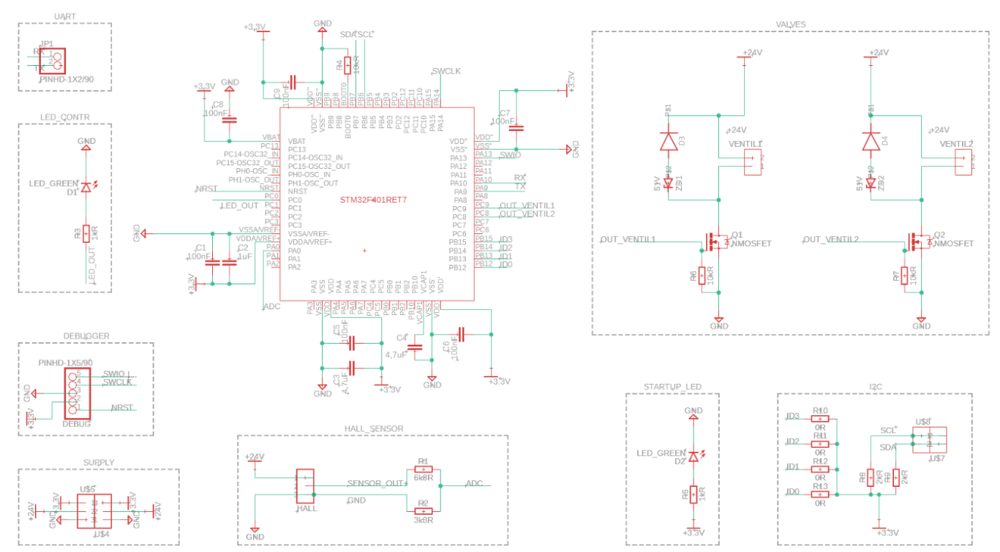

# Electronics
The PCB handles the modular communication with the [test bench](https://tlhabich.github.io/sponge/test_bench/) via I2C. It comprises a STM32F401 microcontroller (μC), circuits for reading sensor signals and controlling the valves as well as wire connections for hardware, inter-integrated circuit (I2C) bus lines and power supply. It is supplied with 24V and 3.3V. Each μC is configured as an I2C target (slave). As the I2C controller (master) serves a NUCLEO-F401RE development board, that is located outside the robot. Attached to it is a Bausano EasyCAT-shield that enables a connection from the NUCLEO board to the EtherCAT bus for communication with the test bench.

  

## Circuit Board

 The [circuit diagram](https://github.com/tlhabich/sponge/blob/master/images/circuit_diagram_modular.png) shows the structure of the board. The μC has 64 pins and a size of 1cmx1cm. Special features are a 12-bit analog-to-digital converter (ADC), a processing frequency of up to 84MHz and different communication interfaces. Every of the 4 VDD/VSS pairs is connected to GND and +3.3V. To stabilize the supply voltage, decoupling capacitors need to be located as close to the supply pins as possible. VDDA/VSSA are the supply pins of the ADC and need an additional 1μF decoupling capacitor. The boot0 pin is pulled to GND via a 10kΩ resistor. This sets the boot mode of the microcontroller. The μC is programmed and debugged over the SWD interface. The 5x1 angled pin header is located on the bottom
 side of the PCB and is connected to GND, 3.3V, and μC-pins (PA14, NRST, and PA13). Using five FE-FE jumper cables, the PCB is connected to a Debugger (ST-LINKV2) that is in turn connected to a PC using USB. For streaming data directly to a PC terminal, the PCB can additionally be connected using USART. A 2x1 angled pin header (bottom side of the PCB) is connected to PA9 and PA10 for USART functionalities.

The Hall encoder is connected to the PCB via a 3x1 socket strip. Its analog output is wired to pin PA0 of the μC. Due to the output range of 0-10V, the ADC pin is protected via conversion to 0-3.3V. For this, a voltage divider circuit with precise resistors (6.8kΩ and 3.3kΩ with 0.05% tolerance) is used. It is an easy way of conversion but adds extra noise to the sensor signal.

The microvalves are connected to the PCB via two 2x1 socket strips. The control signals are sent by the general input-output (GPIO) pins (PC8, PC9) which are connected to the gate pin of an n-channel MOSFET. A 10kΩ pull-down resistor prevents the MOSFET from switching during boot time. The drain and source of the MOSFET are wired to GND and one of the valve connections. The other valve connection is wired to 24V. A diode and a Zener-diode protect the MOSFET from voltage peaks. This is necessary because the valves are essentially an inductance that is rapidly energized and de-energized.

The I2C lines (SDA and SCL) are connected to PB6 and PB7. 2kΩ pull-up resistors are located and must only be soldered **to the first PCB of the chain**. Using two 2x1 socket strips, the PCBs can be interconnected with I2C. One socket strip is located on the bottom side for incoming cables and one is located on the top side for outgoing cables. The I2C address of each device can be hard-wired using solder bridges, that can pull up one pin to VDD each. The pins PB12-15 are used for that, leading to 16 different addresses.

The power supply is connected using two 3x1 socket strips: one on the bottom side of the PCB and one on the top side of the PCB. To indicate the power connection, a LED is located on the PCB. Another LED is connected to the GPIO PC0. It is controllable by the μC and implemented to simplify debugging.

## Components
### On PCB

| name  | type  | quantity   per PCB|
|:----:   |:----:   |:----:   |
|[STM32F401RET7](https://www.mouser.de/ProductDetail/STMicroelectronics/STM32F401RET7?qs=aVyJF2WnouSdX21y3k%2FIAA%3D%3D&_gl=1*7kedwg*_ga*dW5kZWZpbmVk*_ga_15W4STQT4T*dW5kZWZpbmVk*_ga_1KQLCYKRX3*dW5kZWZpbmVk)|microcontroller| 1|
|[C0603C475K9PAC7867](https://www.conrad.de/de/p/kemet-c0603c475k9pac7867-keramik-kondensator-smd-0603-4-7-f-6-3-v-10-l-x-b-x-h-1-6-x-0-8-x-0-8-mm-1-st-457914.html)| capacitor 4.7μF | 2 (C3, C4)|
|[C0603C105K3PAC7867](https://www.conrad.de/de/p/kemet-c0603c105k3pac7867-keramik-kondensator-smd-0603-1-f-25-v-10-1-st-457913.html)| capacitor 1μF | 1 (C2)|
|[C0603C104K3RAC7867](https://www.conrad.de/de/p/kemet-c0603c104k3rac7867-keramik-kondensator-smd-0603-100-nf-25-v-10-l-x-b-x-h-1-6-x-0-35-x-0-8-mm-1-st-1420339.html)| capacitor 100nF | 6 (C1, C5 ,C6, C7, C8, C9)|
|[ERA-8ARW682V](https://www.mouser.de/ProductDetail/Panasonic/ERA-8ARW682V?qs=sGAEpiMZZMvdGkrng054t%2FDNinWxsEFqINH2UjLyDvOyuAvMovfW9A%3D%3D)| resistor 6.8kΩ | 1 (R1)|
|[ERA-8ARW332V](https://www.mouser.de/ProductDetail/Panasonic/ERA-8ARW332V?qs=sGAEpiMZZMvdGkrng054t%2FDNinWxsEFqx3umEpy%2FDGXUbFTeYJVGNQ%3D%3D) | resistor 3.3kΩ | 1 (R2)|
|[CRCW06032K00FKEAHP](https://www.mouser.de/ProductDetail/Vishay-Dale/CRCW06032K00FKEAHP?qs=sGAEpiMZZMvdGkrng054t%2F2njCenThnbx4FzMfd8%2F3U%3D)| pull-up resistor 2kΩ | 2* (R8, R9)|
|[CHP0603QFX-1001ELF](https://www.mouser.de/ProductDetail/Bourns/CHP0603QFX-1001ELF?qs=sGAEpiMZZMvdGkrng054txLI%2FDB4oIKDR8ncaEdJHTUIjHnF%252BQLr%2Fg%3D%3D)| resistor 1kΩ | 2 (R3, R5)|
|[CHP0603AFX-1002ELF](https://www.mouser.de/ProductDetail/Bourns/CHP0603AFX-1002ELF?qs=sGAEpiMZZMvdGkrng054twq3eZrCFN89z2IGcv1iYR0KojvdmUkaDg%3D%3D)| resistor 10kΩ | 3 (R4, R6 ,R7)|
|[1N4005](https://www.mouser.de/ProductDetail/Diotec-Semiconductor/1N4005?qs=OlC7AqGiEDkApgJXD56PnA%3D%3D)| diode| 2 (D3, D4)|
|[1N4757A](https://www.mouser.de/ProductDetail/onsemi-Fairchild/1N4757A?qs=SSucg2PyLi6WXSgUxZhJMg%3D%3D)| Zener-diode| 2 (ZD1, ZD2)|
|[11-21SURC/S530-A2/TR8](https://www.conrad.de/de/p/everlight-opto-11-21surc-s530-a2-tr8-smd-led-1206-rot-71-mcd-60-20-ma-2-v-tape-cut-156310.html)| LED | 2 (D1, D2)|
|[IRLML0030TRPBF](https://www.conrad.de/de/p/infineon-technologies-irlml0030trpbf-mosfet-1-n-kanal-1-3-w-sot-23-161180.html)| n-channel MOSFET| 2 (Q1, Q2)|
| - | socket strip 3x1 | 3|
| - | socket strip 2x1 | 4|
| - | pin header angled 5x1 | 1|
| - | pin header angled 2x1 | 1|

\*Must only be soldered to **1 PCB** within a robot
### Other

|name | type |quantity |
|:----|:----:|:----:|
|[NUCLEO-F401RE](https://www.mouser.de/ProductDetail/STMicroelectronics/NUCLEO-F401RE?qs=sGAEpiMZZMuqBwn8WqcFUv%2FX0DKhApUpi46qP7WpjrffIid8Wo1rTg%3D%3D)| development board | 1|
|[ST-Link V3 Set](https://www.mouser.de/ProductDetail/STMicroelectronics/STLINK-V3SET?qs=qSfuJ%252bfl%2Fd5d4WYsOW6M6w%3D%3D)| debugger | 1|
|[EasyCAT shield](https://www.bausano.net/shop/en/home/16-arduino-ethercat.html)| EtherCAT interface| 1|
|-| UART-TTL USB adapter   (optional)|1|
|-| jumper cable FE-FE | 5|
|-| jumper cable M-M | 5*|

*Per actuator

## Manufacturing

The [Gerber Files](/sponge/downloads/SPONGE_Modular_PCB_Gerber.zip) can be directly sent to a PCB manufacturer. After that, we soldered the components onto the board ourselves.
## Software
The [software](https://github.com/tlhabich/sponge/tree/main/test_bench/software/modular_robot_i2c) consists of operation code for the PCB and the I2C controller. The I2C controller (STM32-Nucleo Board with an EasyCAT shield) receives commands from the [test bench](https://tlhabich.github.io/sponge/test_bench/) via EtherCAT and sends back the measured sensor signals. The code is developed with the [Arduino IDE](https://www.arduino.cc/). Because the library for the EasyCAT shield is only available for Arduino or [Mbed](https://os.mbed.com/) (online ARM-processer IDE), the Arduino IDE is required to compile the code. Remember to install the following libraries: [EasyCAT](https://www.bausano.net/en/hardware/easycat.html) and [elapsedMillis](https://www.arduino.cc/reference/en/libraries/elapsedmillis/).

The PCB code is developed using the [STM32 Cube IDE](https://www.st.com/en/development-tools/stm32cubeide.html#get-software), which is required to compile the code. It continuously buffers the ADC readings and sends them when requested. Whenever the I2C controller sends a command for the valves, an interrupt callback occurs. It sets the state of the GPIO pins assigned to switching the valves.
