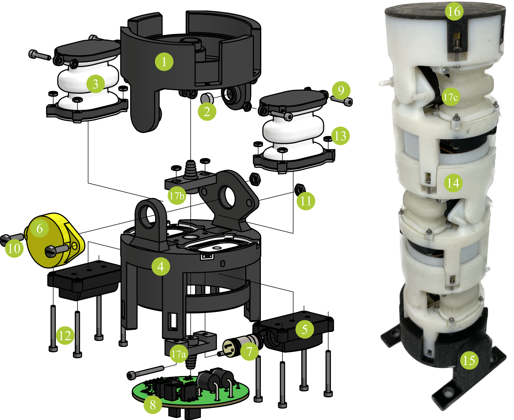

# Building Instructions

## Components

| part no. | name | function | quantity   per actuator |
| :----: | :----: | :----: | :----: |
| **(1)** | upper frame | joint mounting platform|1|
|**(2)**| magnet | angle measurement | 1|
| **(3)** | bellows | actuation |2|
| **(4)** | lower frame | joint mounting platform pneumatics|1|
| **(5)** | valve interface | valve integration|2|
| **(6)** | [encoder ETA25K](https://www.megatron.de/en/products/angle-sensors/encoder-etx25k-with-3d-hall-as-kit-versions.html) | angle measurement|1|
| **(7)** | [microvalve VA 304-913](https://www.staiger.de/en-us/products/online-catalogue/details?name=VA%20304-913) | actuation |2|
|**(8)**| [PCB](https://tlhabich.github.io/sponge/designs/modular/electronics.html)| communication|1|
|**(9)**| screw M2x12 | mounting of bellows connect adjacent actuators | 8 or 12* |
|**(10)**| screw M3x10 | mounting| 2 |
|**(11)**| nut M3 | mounting | 2 |
|**(12)**| screw M2x20 | airtight mounting of tube connectors   and bellows/interfaces  | 10 |
|**(13)**| nut M2 | mounting| 18 or 22* |
|**(14)**| tube (6mm diameter)| pneumatics| 1 or 0* |
|**(15)**| stand | hold robot | 1** |
|**(16)**| lid | close (optically) last actuator| 1**|
|**(17a)**| tube connector bottom | pneumatics| 1|
|**(17b)**| tube connector top | pneumatics| 1 or 0*|
|**(17c)**| pressure supply end using  **(17b)** without connector | close pneumatic supply| 0 or 1*|

\*for the last actuator of an assembled robot 
\*\*once per robot

## Assembly
### Single Actuator
1. Mount **(6)** into **(4)** on the inner side using **(10)** and **(11)** and lead the cable through the hole in **(4)**.
2. Insert **(2)** into the joint shaft in **(1)**.
3. Assemble frames: Slightly bend **(4)** and insert into **(1)**. **(2)** and **(6)** must oppose each other.
4. Mount **(17a)** to **(4)** using **(12)** and **(13)**
5. Mount **(17b)** to **(4)** using **(12)** and **(13)** (Mount **(17c)** instead, if building the last actuator).
6. Insert **(7)** into **(5)**. Using alcohol as lubricant makes this process easier. For further information, please refer to the microvalve datasheet.
7. Insert **(5)** into recesses in **(4)**. The curve of **(5)** must align with the curve of **(4)**.
8. Insert **(3)** into recesses in **(4)**.
9. Join the parts together with **(12)** and **(13)**.
10. Insert the upper part of **(3)** between the mounting extensions on **(1)**. Secure it by **(9)** and **(13)**.
11. Connect the cables to **(8)**.

### Stacking
1. Insert the first actuator into **(15)**, attach pressure supply to **(17a)** and connect **(8)** to test bench.
2. Attach **(14)** to **(17a)** of an adjacent actuator (lead it through the hole in the PCB). Connect the two adjacent PCBs.
3. Stack the actuators (lead the pipe segment trough the hole in the middle of the upper frame) and attach tube segment to **(17b)**.
4. Secure both actuators using **(9)** and **(13)**.
5. Repeat 2-4 for all actuators
6. Attach **(16)** to the last actuator of an assembled robot using **(9)** and **(13)**.

## 3D-Printing
When you [downloaded](/sponge/downloads/SPONGE_Modular_CAD_stl.zip) the .stl files, you need to pay attention to the preparation of the files for printing. Most parts, printed with Polyjet technology, need to be printed as an assembly (some parts only consist of a single file). In general, the folder structure is such that each assembly has its own folder. Use “add as assembly” to create the print job. The valve interfaces are printed using resin technology. Pay attention that no support structures may be generated inside the cavities.

| part no. |material | files |
| :----: | :----: | :----: |
|**(1)**|VeroBlackPlus/VeroWhitePlus | upper_frame.stl |
|**(1)**|Agilus30 | upper_frame_magnet_lip.stl |
|**(3)**|VeroBlackPlus/VeroWhitePlus | bellow_lower_platform.stl bellow_upper_platform.stl |
|**(3)**|Agilus30 | bellow_membrane.stl   bellow_seal.stl|
|**(4)**|VeroBlackPlus/VeroWhitePlus |lower_frame.stl |
|**(4)**|Agilus30 | lower_frame_tube_connector_seal_1.stl   lower_frame_tube_connector_seal_2.stl  lower_frame_sealing_bellow_1.stl   lower_frame_sealing_bellow_2.stl  lower_frame_sealing_valve_interface_1.stl   lower_frame_sealing_valve_interface_2.stl|
|**(5)**|BlackV4 | valve_interface.stl |
|**(15)**|VeroBlackPlus/VeroWhitePlus | stand.stl |
|**(16)**|VeroBlackPlus/VeroWhitePlus | lid.stl |
|**(17a)**|VeroBlackPlus/VeroWhitePlus | tube_connector_bottom.stl |
|**(17b)**|VeroBlackPlus/VeroWhitePlus | tube_connector_top.stl |
|**(17c)**|VeroBlackPlus/VeroWhitePlus | tube_connector_end.stl |
