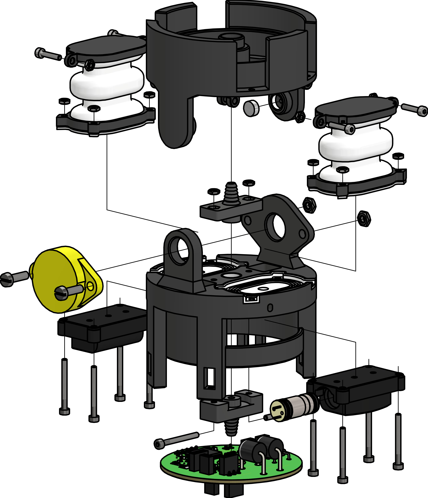
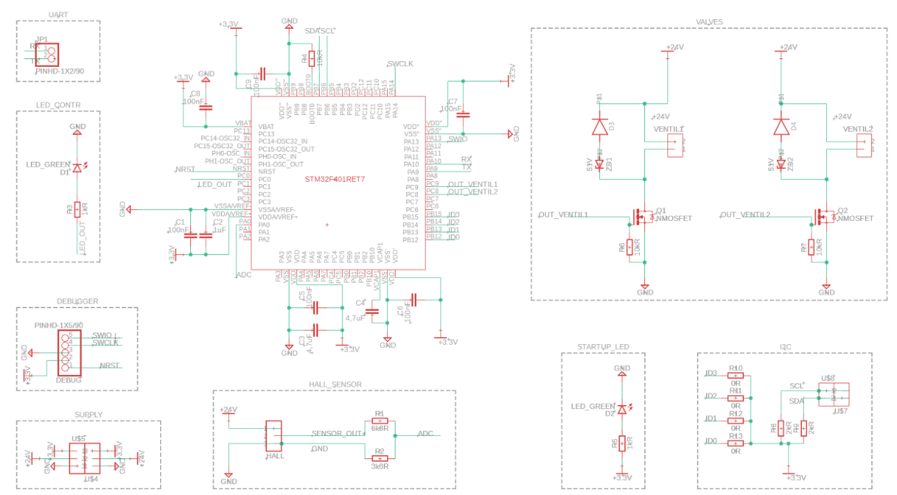

# Modular SPONGE
The actuator has a diameter of 66 mm and a total height of 94 mm. The angular range is approximately ±40°. at a maximum working pressure of approximately 0.3 bar. A PCB reads the sensor signal and controls microvalves.
## Downloads

* 3D models
   * [Files for 3D-Printer (.stl)](/sponge/downloads/SPONGE_Modular_stl.zip)
   * [CAD-Files created with Autodesk Inventor (.ipt,.iam)](/sponge/downloads/SPONGE_Modular_CAD_inventor.zip)
* PCB
  * [Gerber Files (.zip)](/sponge/downloads/SPONGE_PCB_Gerber.zip)
  * [Fusion360 files (.f3z,.sch,.brd)](/sponge/downloads/SPONGE_PCB_F360.zip)
  * [Code](https://github.com/tlhabich/sponge/tree/main/test_bench/software/modular_robot_i2c)

## Details

|Building Instructions|Electronics|
|:----:|:----:|
|||
