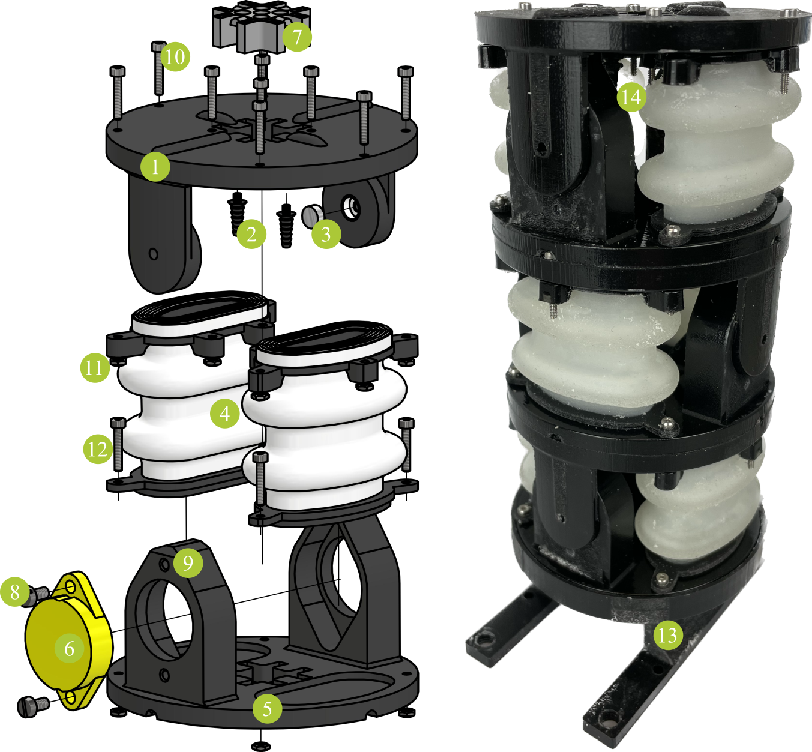

# Building Instructions

## Components

|part no. | name | function | quantity   per actuator|
| :----: | :----: | :----: | :----: |
| **(1)** | upper frame | joint mounting platform   pneumatics | 1 |
| **(2)** | tube connector | pneumatics | 2 |
| **(3)** | magnet | angle measurement | 1 |
| **(4)** | bellows | actuation | 2 |
| **(5)** | lower frame | joint mounting platform| 1 |
| **(6)** | [encoder ETA25K](https://www.megatron.de/en/products/angle-sensors/encoder-etx25k-with-3d-hall-as-kit-versions.html) | angle measurement| 1 |
| **(7)** | cable/tube guide | simplify assembly | 1 |
| **(8)** | screw M3x10 | mounting | 2 |
| **(9)** | nut M3 | mounting | 2 |
| **(10)** | screw M2x10 | airtight mounting of bellows | 6* |
| **(11)** | nut M2 | mounting| 10** |
| **(12)** | screw M2x16 | airtight mounting of bellows connect adjacent actuators | 4*** |
| **(13)** | stand | hold robot | 1\*\*\*\* |
| **(14)** | tube (2mm diameter) |pneumatics| 2 |

\*10 for the first/last actuator of an assembled robot  
\*\*14 for the last actuator of an assembled robot 
\*\*\*0 for the first actuator and 4 for the last actuator of an assembled robot 
\*\*\*\*once per robot

## Assembly
### Single Actuator

1. Insert **(3)** into the joint shaft in **(1)**.
2. Insert **(2)** into recesses in **(1)**.
3. Insert **(6)** into the recess in **(5)**. Lead cable through **(7)**.
4. Secure **(6)** using **(8)** and **(9)**.
5. Assemble frames: Slightly bend **(1)** and insert the shafts into **(5)**. **(3)** and **(6)** must oppose each other.
6. Attach **(14)** to **(2)** and lead them through **(7)**.
7. Insert **(11)** into the recesses in **(4)** and **(5)**.
8. Insert **(4)** into frame (open side up).
9. Secure **(4)** at top using 3x**(9)** per bellows. If you want to stack actuators, the other screws are added later. For the last actuator in a chain, use 5x**(9)** per bellows.
10. The remaining screws **(12)** are secured during stacking. When assembling only one single actuator (instead of a robot with several actuators), use **(10)** for the remaining screws.

### Stacking

Start with the last actuator (tip of the robot) towards the first actuator (base of the robot):

1. Lead tubes/cables through **(7)** of the next actuator.
2. Mount actuators on top of each other (90° of rotation for spatial motion).
3. Join the lower (bellows) platform of one actuator and the upper (bellows) platform of the other using 4x**(12)**.
4. Repeat 1-3 for all actuators.
5. Insert **(11)** into the hexagonal recesses in **(13)**.
6. Mount the robot into **(13)** using **(10)** through the lower (bellows) platform of the first actuator in the chain.

## 3D-printing

When you [downloaded](/sponge/downloads/SPONGE_SemiModular_CAD_stl.zip) the .stl files, you need to pay attention to the preparation of the files for printing. Most parts, printed with Polyjet technology, need to be printed as an assembly (some parts only consist of a single file). In general, the folder structure is such that each assembly has its own folder. Use “add as assembly” to create the print job.

| part no. |material | files |
| :----: | :----: | :----: |
|**(1)**|VeroBlackPlus/VeroWhitePlus | upper_frame.stl |
|**(1)**|Agilus30 | upper_frame_sealing_bellow_1.stl   upper_frame_sealing_bellow_2.stl   upper_frame_magnet_lip.stl   upper_frame_connector_lip_1.stl   upper_frame_connector_lip_2.stl   |
|**(2)**|VeroBlackPlus/VeroWhitePlus | tube_connector.stl |
|**(4)**|Agilus30 | bellow_sealing.stl   bellow_membrane.stl |
|**(4)**|VeroBlackPlus/VeroWhitePlus | bellow_platform.stl |
|**(5)**|VeroBlackPlus/VeroWhitePlus | lower_frame.stl |
|**(7)**|VeroBlackPlus/VeroWhitePlus | cable_guide.stl |
|**(13)**|VeroBlackPlus/VeroWhitePlus | stand.stl |

[def]: mages/actuator_extvalve_components.pn
