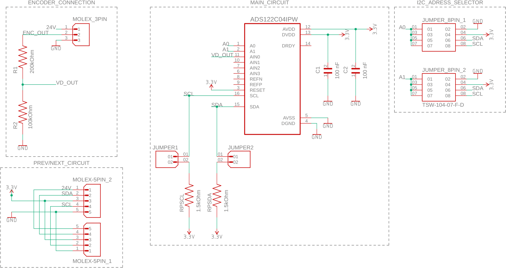

# Semi-Modular SPONGE
The actuator has a diameter of 82mm and a total height of 52mm. The sensor signals are directly sent to the [test bench](https://tlhabich.github.io/sponge/test_bench/) via cables.
## Downloads

* 3D models
   * [Files for 3D-Printer (.stl)](/sponge/downloads/SPONGE_SemiModular_stl.zip)
   * [CAD-Files (.stp)](/sponge/downloads/SPONGE_SemiModular_step.zip)
* PCB
   * [Gerber Files (.zip)](/sponge/downloads/SPONGE_SemiModular_PCB_Gerber.zip)
   * [Code](https://github.com/tlhabich/sponge/tree/main/test_bench/software/semimodular_robot_i2c)

## Details

|Building Instructions|Electronics (optional)|
|:----:|:----:|
|||

## Improvements after Publication
Further design improvements were made after the [RA-L publication](https://arxiv.org/abs/2404.10734). The above instructions are still valid, taking into account the new parts. The changes are listed in detail below. The new files are also available.
### Version 2
Summary: joint-friction reduction, less plastic deformation of the frames, thicker bellows for higher pressures, larger tube diameters for improved pressure dynamics
* [Updated files (.stl, .stp)](/sponge/downloads/SPONGE_SemiModular_V2.zip)
* Upper frame
  * Shaft diameter decreased to reduce friction
  * Reinforced shaft holders to prevent deformation
* Lower frame
  * Bearing diameter decreased to reduce friction
  * Reinforced bearing holders to prevent deformation
  * Reinforced mounting platform to prevent deformation
* Bellows
  * Wall thickness increased to 3.5mm to increase maximum working pressure to 0.7bar (molding parts also updated for this)
* Tubes
  * Tube diameter increased to 3mm to improve pressure dynamics (tube openings in upper/lower frame, tube connector and cable guide also updated for this)

### PCB for Modular Communication
Please see above under "Electronics (optional)".
