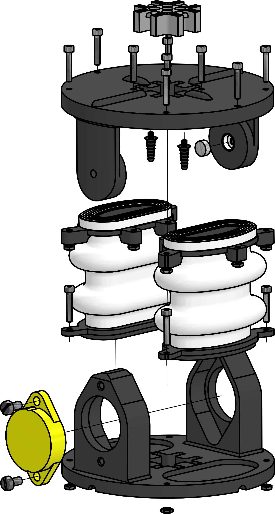

# Semi-Modular SPONGE
The actuator has a diameter of 82mm and a total height of 52mm. The angular range is approximately ±18.5° at a maximum working pressure of approximately 0.35bar. The sensor signals are directly sent to the [test bench](https://tlhabich.github.io/sponge/test_bench/) via cables.
## Downloads

* 3D models
   * [Files for 3D-Printer (.stl)](/sponge/downloads/SPONGE_SemiModular_CAD_stl.zip)
   * [CAD-Files created with Autodesk Inventor (.ipt,.iam)](/sponge/downloads/SPONGE_SemiModular_CAD_inventor.zip)

## Details

|Building Instructions|
|:----:|
|
