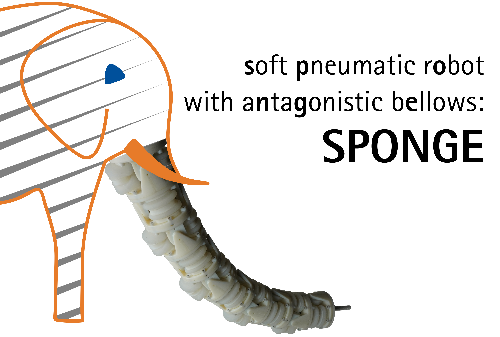

<p align="center">

</p>

# Welcome to the documentation of SPONGE!

SPONGE is a **s**oft **p**neumatic r**o**bot with a**n**ta**g**onistic b**e**llows that is being developed at the Leibniz University Hannover by the [Institute of Mechatronic Systems](https://www.imes.uni-hannover.de/en/). Inspired by nature, the articulated soft robot (ASR) SPONGE consists of a vertebrate-like structure with rigid links and compliant joints. The latter are realized by soft pneumatic bellows, which are placed antagonistically.

## Why SPONGE?
Building soft robots has been a growing research field for several years. In contrast to their rigid counterparts, these robots are made of significantly softer materials. Compliance makes them suitable robot candidates for tasks involving safe interaction with humans due to less damage in the event of a collision. The number of soft-robot designs is ever-increasing. Often, the designs are only available via descriptions in publications that are typically incomplete. This makes it hard for beginners in soft robotics to get hands-on experience and build such robots.

In addition, the variety of designs makes it difficult to compare published methods. The control of such nonlinear systems can serve as an example: Due to complex geometries, material nonlinearities, and air compressibility, controlling such robots is challenging and a popular research field. Comparing the performance of different methods is difficult because the results in each work were obtained with a specific soft robot. If the systems were uniform, it would be possible to test the methods on real benchmark systems, e.g., like the inverted pendulum or Furuta pendulum in control theory.

That's why the entire project is made freely available, including detailed descriptions of manufacturing and assembly, downloads for CAD models and PCB designs as well as lists of purchased parts and the whole test-bench software. This way, anyone can rebuild the systems and follow up on our work. SPONGE is available in two variants: semi-modular vs. modular. The former is only modular in terms of stackability, whereas the latter is modular in terms of stackability, actuation, and communication. More info can be found in the related RA-L publication. Further design improvements were made to the semi-modular robot after the RA-L publication, as presented [here](https://tlhabich.github.io/sponge/designs/semi_modular/main.html).

## Video
<iframe width="560" height="315" src="https://www.youtube.com/embed/TMLpRXZHuLA?si=7h0NEn7rlYwk9cts" title="YouTube video player" frameborder="0" allow="accelerometer; autoplay; clipboard-write; encrypted-media; gyroscope; picture-in-picture; web-share" referrerpolicy="strict-origin-when-cross-origin" allowfullscreen></iframe>

## Citing
The paper is [freely available](https://arxiv.org/abs/2404.10734) via arXiv. If you use parts of this project for your research, please cite the following publication:
```
SPONGE: Open-Source Designs of Modular Articulated Soft Robots
T.-L. Habich, J. Haack, M. Belhadj, D. Lehmann, T. Seel, and M. Schappler
IEEE Robotics and Automation Letters (RA-L) 2024
DOI: 10.1109/LRA.2024.3388855
```
## Further Publications
- [Learning-based Position and Stiffness Feedforward Control (IEEE-RAS RoboSoft 2023)](https://arxiv.org/abs/2303.01840)
- [Intuitive Telemanipulation within Locomotion and Reorientation (IEEE ICRA 2023)](https://arxiv.org/abs/2303.00065)
- [Learning-based Model Predictive Control using Recurrent Neural Networks (IEEE RA-L 2024)](https://arxiv.org/abs/2411.05616)
- [Physics-Informed Neural Networks for Learning and Control (under review)](https://arxiv.org/abs/2502.01916)

## Authors
SPONGE is part of the PhD thesis of [Tim-Lukas Habich](https://www.imes.uni-hannover.de/en/institute/team/m-sc-tim-lukas-habich) (Email: <tim-lukas.habich@imes.uni-hannover.de>) and was developed with support from colleagues (Moritz Schappler, Dustin Lehmann, Thomas Seel, Dennis Bank) and supervised students (Jonas Haack, Mehdi Belhadj, Sarah Kleinjohann, Jan Christoph Haupt).
