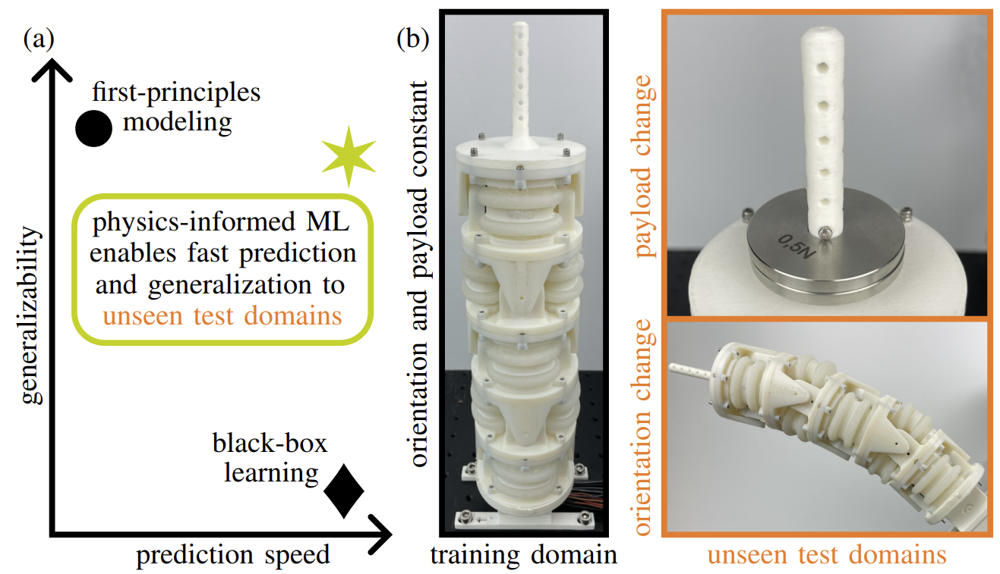

# Physics-Informed Neural Networks for Learning and Control
<p align="center">

</p>

The work is currently under review. After acceptance you will find the datasets and the codebase for learning/control on this page.

## Citing
The paper is [freely available](https://arxiv.org/abs/2502.01916) via arXiv. If you use parts of this project for your research, please cite the following publication:
```
Generalizable and Fast Surrogates: Model Predictive Control of Articulated Soft Robots using Physics-Informed Neural Networks
T.-L. Habich, A. Mohammad, S. F. G. Ehlers, M. Bensch, T. Seel, M. Schappler
Currently under review
```
