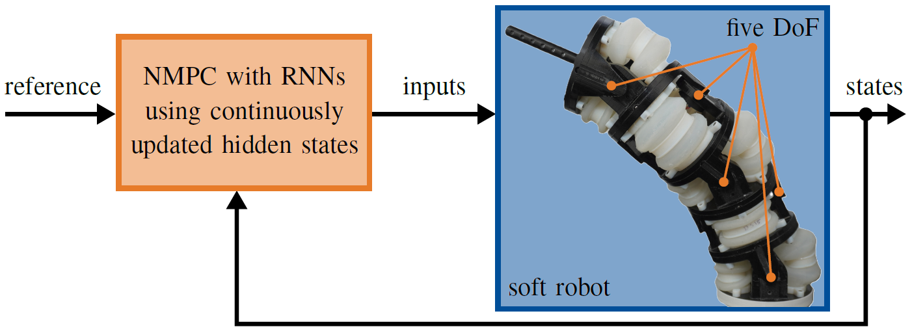

# Nonlinear Model Predictive Control with Recurrent Neural Networks
<p align="center">

</p>

This page describes the implementation of a learning-based nonlinear model predictive control (NMPC) using recurrent neural networks (RNNs), which is experimentally validated with SPONGE. The RNNs are trained in PyTorch, and their hyperparameters are optimized via ASHA. One RNN is then integrated into Simulink and used as model within NMPC. For this purpose, CasADi is integrated into Simulink as an S-function, enabling its use on a real-time computer. The code is based on the [originally test-bench software](https://tlhabich.github.io/sponge/test_bench/). It is therefore recommended that you familiarize yourself with this software.

**The code for RNN training, hyperparameter optimization and learning-based NMPC with RNNs can be found in the [git repository](https://github.com/tlhabich/sponge/tree/main/rnn_mpc/software).**

## Additional Requirements
- [CasADi](https://github.com/casadi/casadi/wiki/InstallationLinux) installed as a source build with IPOPT solver
- [yaml-cpp v0.6.0](https://github.com/jbeder/yaml-cpp)
- [YAMLMatlab_0.4.3](https://github.com/ewiger/yamlmatlab)

## Usage
1. Set up the test bench following these [instructions](https://tlhabich.github.io/sponge/test_bench/)
2. Dev-PC: Copy all files from this repository to the test-bench folder. Overwrite any files with duplicate names
3. Dev-PC: Compile the shared library by running ``$ ./build.sh 1``
4. Dev-PC: Initialize parameters and open Simulink model via ``init.m``
5. Dev-PC: If necessary, modify Simulink model
6. Dev-PC: Compile/create the model by executing ``build.m`` (If the S-function block needs to be reinserted: In `./Extern/MPCcasadiSFunction/mFiles/generateslblock.m`, set a breakpoint in the last line before `close_system('untitled', 0)`)
7. Dev-PC: Compile ROS-Workspace and copy to RT-PC via ``$ ./build.sh && ./sync.sh``
8. Connect to RT-PC via SSH and run the following commands on RT-PC: ``$ sudo /etc/init.d/ethercat start`` (start EtherCAT master) and ``$ ~/app_interface/ros_install/scripts/autostart.sh && tmux attach-session -t app`` (start compiled model)
9. Dev-PC: Start external mode in Simulink model via ``Connect To Target`` to visualize/record data or alter settings
10. After the experiment on RT-PC: ``Ctrl+c`` in tmux window, ``$ tmux kill-session`` and ``$ sudo /etc/init.d/ethercat stop`` to stop the EtherCAT master

## Citing
The paper is [freely available](https://arxiv.org/abs/2411.05616) via arXiv. If you use parts of this project for your research, please cite the following publication:
```
Learning-based Nonlinear Model Predictive Control of Articulated Soft Robots using Recurrent Neural Networks
H. Schäfke, T.-L. Habich, C. Muhmann, S. F. G. Ehlers, T. Seel, and M. Schappler
IEEE Robotics and Automation Letters (RA-L) 2024
DOI: 10.1109/LRA.2024.3495579
```
