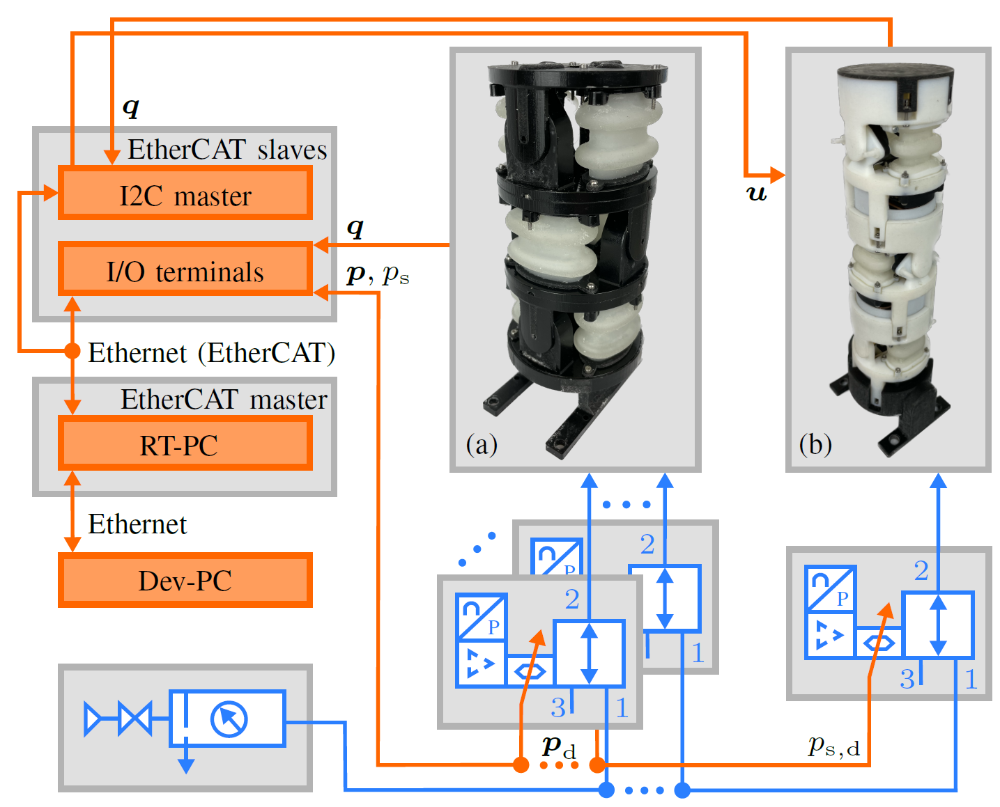

# Test Bench

The main components are the pneumatic supply, a development computer (Dev-PC), a real-time computer (RT-PC), several EtherCAT slaves, proportional piezo valves ([Festo VEAA-B-3-D2-F-V1-1R1](https://www.festo.com/de/en/a/8046892/)) with integrated pressure control and the robots. The pneumatic supply can be enabled and disabled using a shut-off valve. A filter removes particles and sets the supply pressure approximately to a constant level with a manual regulator. Connected in series to the supply unit is an array of piezo valves. The user can select how many pneumatic connections are needed for the particular application. For the modular SPONGE, one valve needs to be connected regardless of its length to precisely control the supply pressure of the robot. The semi-modular ASR with n actuators needs 2n valves.

The test bench allows real-time data acquisition and system control with a cycle time of one millisecond (hard real-time). The RT-PC runs the compiled Simulink model, which is developed on the Dev-PC. Data can be streamed between both computers so that it can be visualized and settings can be altered during runtime in Simulink external mode. The test bench communication is realized using EtherCAT protocol and the corresponding open-source [Etherlab](https://www.etherlab.org/) with an added [external-mode patch and a shared-memory real-time interface](https://github.com/SchapplM/etherlab-examples). The sensor values and desired pressures of the semi-modular ASR are read or set using input and output terminals ([EL3702](https://www.beckhoff.com/en-us/products/i-o/ethercat-terminals/el3xxx-analog-input/el3702.html) and [EL4102](https://www.beckhoff.com/en-us/products/i-o/ethercat-terminals/el4xxx-analog-output/el4102.html)). The modular robot is connected via the I2C master to the test bench.

**The code and further instructions for the entire test bench can be found in the [git repository](https://github.com/tlhabich/sponge/tree/main/test_bench/software).**
