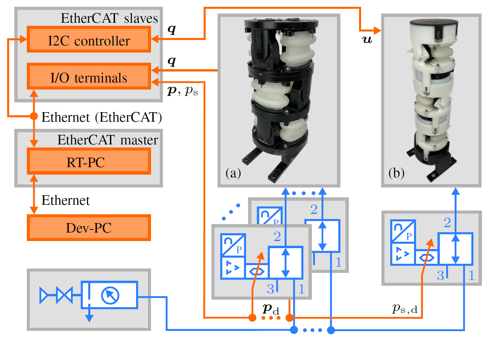

# Test Bench

The main components are the pneumatic supply, a development computer (Dev-PC), a real-time computer (RT-PC), several EtherCAT slaves, proportional piezo valves ([Festo VEAA-B-3-D2-F-V1-1R1](https://www.festo.com/de/en/a/8046892/)) with integrated pressure control and the robots. The pneumatic supply can be enabled and disabled using a shut-off valve. A filter removes particles and sets the supply pressure approximately to a constant level with a manual regulator. Connected in series to the supply unit is an array of piezo valves. The user can select how many pneumatic connections are needed for the particular application. For the modular SPONGE, one valve needs to be connected regardless of its length to precisely control the supply pressure of the robot. The semi-modular ASR with n actuators needs 2n valves. The sensor values and desired pressures of the semi-modular ASR are read or set using input and output terminals ([EL3702](https://www.beckhoff.com/en-us/products/i-o/ethercat-terminals/el3xxx-analog-input/el3702.html) and [EL4102](https://www.beckhoff.com/en-us/products/i-o/ethercat-terminals/el4xxx-analog-output/el4102.html)). The modular robot is connected via the I2C controller to the test bench.

The communication is realized using EtherCAT protocol and the corresponding open-source tool [EtherLab](https://etherlab.org/) with an added [external-mode patch and a shared-memory real-time interface](https://github.com/SchapplM/etherlab-examples). Note that this enables (hard) real-time system control, data acquisition, online visualization and alteration of settings during runtime via Simulink. The RT-PC runs the compiled Simulink model, which is developed on the Dev-PC. A ROS integration is also possible.

**The code for the entire test bench can be found in the [git repository](https://github.com/tlhabich/sponge/tree/main/test_bench/software).**

## Requirements
- Matlab R2018b (tested with this version)
- RT-PC with EtherCAT ([SETUP_RTPC.MD](https://github.com/SchapplM/etherlab-examples/blob/master/SETUP_RTPC.MD) and [SETUP_ETHERCAT.MD](https://github.com/SchapplM/etherlab-examples/blob/master/SETUP_ETHERCAT.MD)).
- Dev-PC with EtherLab (also [SETUP_ETHERCAT.MD](https://github.com/SchapplM/etherlab-examples/blob/master/SETUP_ETHERCAT.MD))

If a printed circuit board (PCB) is used in SPONGE:
- Arduino-like development board  with [EasyCAT shield](https://www.bausano.net/shop/en/home/16-arduino-ethercat.html) (tested on [NUCLEO-F401RE](https://www.mouser.de/ProductDetail/STMicroelectronics/NUCLEO-F401RE?qs=sGAEpiMZZMuqBwn8WqcFUv%2FX0DKhApUpi46qP7WpjrffIid8Wo1rTg%3D%3D). Similar boards are suitable as long as they share the Arduino pin configuration and support I2C and SPI communication protocols)
- SWD programming device (such as [ST-Link V3 Set](https://www.mouser.de/ProductDetail/STMicroelectronics/STLINK-V3SET?qs=qSfuJ%252bfl%2Fd5d4WYsOW6M6w%3D%3D))
- [Arduino IDE](https://www.arduino.cc/) and [EasyCAT Library](https://www.bausano.net/en/hardware/easycat.html)
- [STM32 Cube IDE](https://www.st.com/en/development-tools/stm32cubeide.html#get-software)

## Usage
1. Dev-PC: Initialize parameters and open Simulink model via ``init.m``
2. Dev-PC: If necessary, modify Simulink model
3. Dev-PC: Compile/Build model via ``Ctrl+b``
4. Dev-PC: Compile ROS-Workspace and copy to RT-PC via ``$ ./build.sh && ./sync.sh``
5. Connect to RT-PC via SSH and run the following commands on RT-PC: ``$ sudo /etc/init.d/ethercat start`` (start EtherCAT master) and ``$ ~/app_interface/ros_install/scripts/autostart.sh && tmux attach-session -t app`` (start compiled model)
6. Dev-PC: Start external mode in Simulink model via ``Connect To Target`` to visualize/record data or alter settings
7. After the experiment on RT-PC: ``Ctrl+c`` in tmux window, ``$ tmux kill-session`` and ``$ sudo /etc/init.d/ethercat stop`` to stop the EtherCAT master
8. Dev-PC: Postprocessing via ``postprocess.m`` (saves recorded data in single file: ``measurements_struct.mat``)
